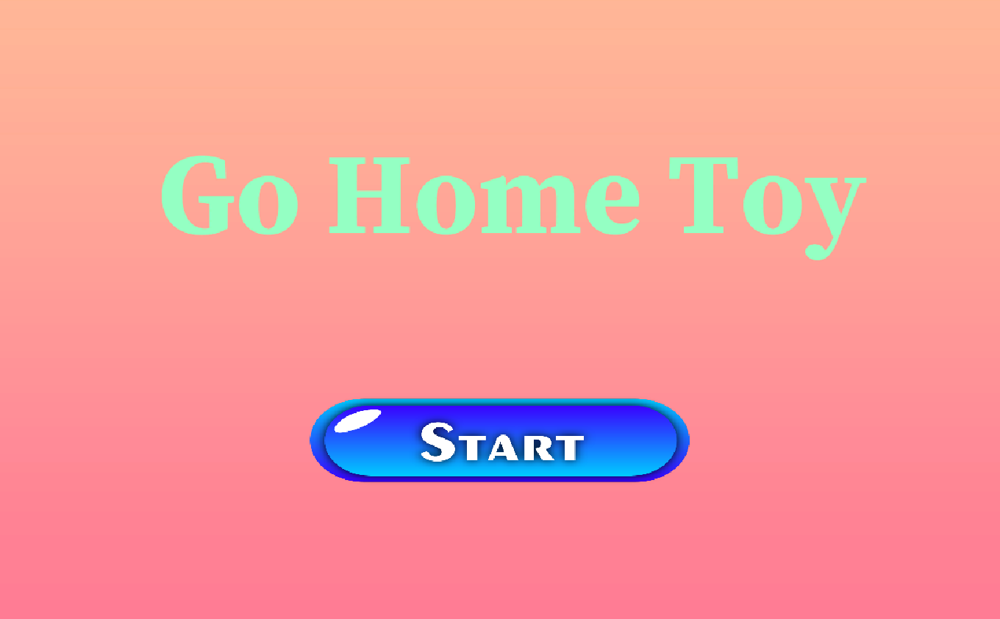
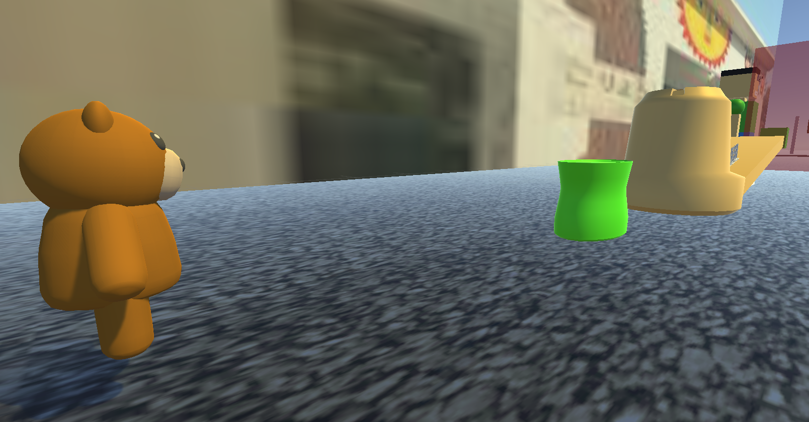
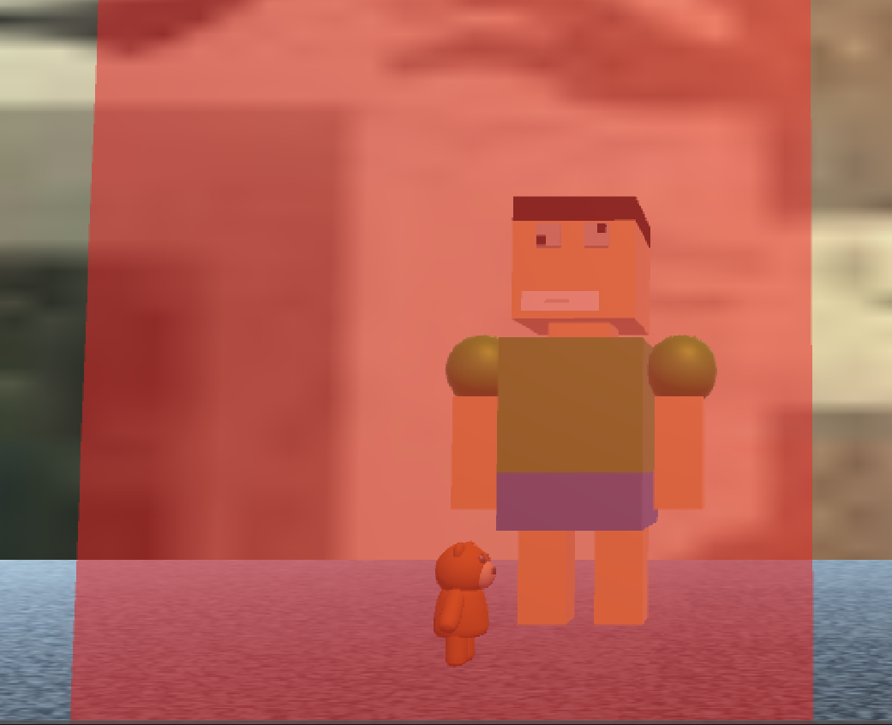
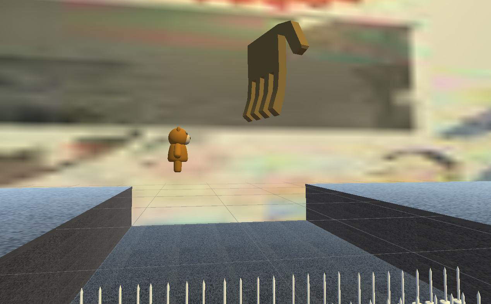
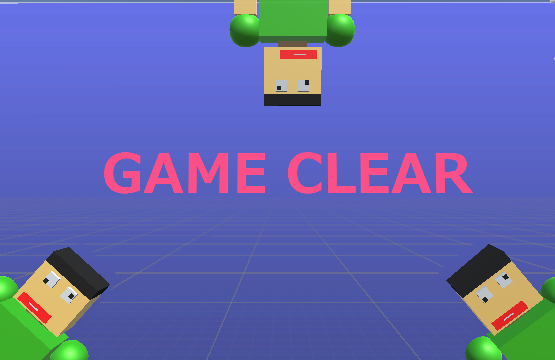

# GoHomeToy

## ファイル構成
*[Unityデータ](.ProjectDate/)
*[ビルドデータ](./ScreenShot/)

## ジャンル
横スクロールアクション

## ビルドデータ
[Windowsビルドデータ](https://drive.google.com/drive/folders/1vyW5iIr16wSZNQxAQksQwSOtSCcgmRcz)

## 担当プログラムファイル
*[敵の視点の切り替え](./ProjectDate/Assets/Scripts/FunSearch.cs)
*[ゲームシーンへの移行](./ProjectDate/Assets/Scripts/StartButton.cs)

## ゲームストーリー
持ち主のもとを離れてしまったぬいぐるみが元の場所へ戻ろうとする

## ゲームルール
人の視線や障害物を避けながらゴールに向かう

## Unityバージョン
Unity 2022.3.7f1

## 制作期間
2カ月

## メンバー(役割)
*國吉蒼天 (プログラマー)
*伊敷蒼 (プログラマー)
*大城侑 (プランナー)

## ゲームスクリーンショット

